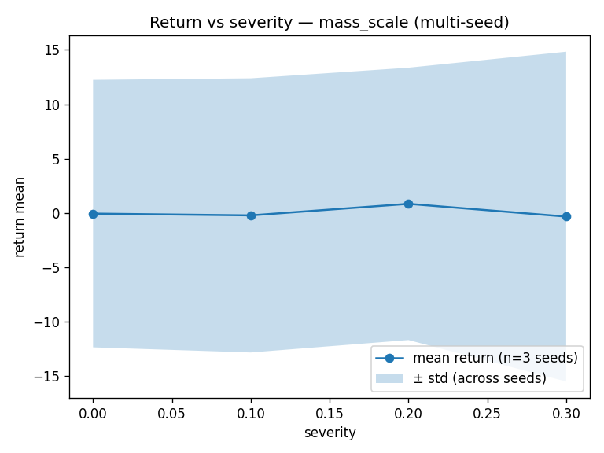
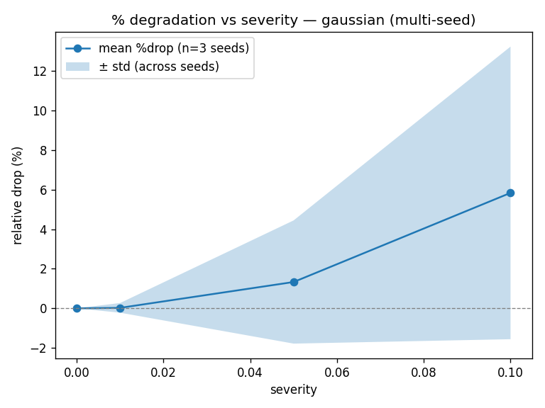

# robust-rl-locomotion: Evaluation-Time Robustness of PPO under Observation and Dynamics Shift

[](https://github.com/imabhi80/robust-rl-locomotion/actions/workflows/ci.yml)
[](https://doi.org/10.5281/zenodo.18837162)

---

## Overview

This repository provides a controlled evaluation study of deployment-time robustness for a standard
Proximal Policy Optimisation (PPO) agent trained on HalfCheetah-v4 (Gymnasium / MuJoCo).

The central research question is: **how does a vanilla PPO policy degrade under evaluation-time
distribution shift, and does the sensitivity differ between observation-space perturbations and
dynamics-parameter perturbations?**

Two shift types are studied. The first is additive Gaussian observation noise, which models sensor
corruption or calibration error at inference time. The second is uniform body-mass scaling, which
models the sim2real parameter mismatch arising from discrepancies between simulation and physical
hardware. Both perturbations are applied exclusively at evaluation time; the training procedure and
policy architecture are left entirely unmodified.

Evaluation is carried out under a fully deterministic protocol: episode seeds are fixed across all
severity levels and shift types, seeding decisions are committed to a SHA-256 hash logged alongside
every result, and all experiments are replicated across three independently-trained random seeds.
Reported metrics are relative degradation (percentage return drop from the clean baseline) and the
area under the return-vs-severity curve (AUC), computed by the trapezoidal rule. This repository
does not claim improved robustness or propose a new algorithm. It provides a reproducible baseline
measurement and evaluation harness for future work.

Version 1.0 focuses on protocol validation under a low training budget; future releases will report results at 1M timesteps for converged policies.

---

## Empirical Snapshot

Results below are from the multi-seed experiment: seeds 0, 1, 2; 20 000 timesteps each;
10 evaluation episodes per severity level. See `results/agg_multiseed_exp/` for full CSV outputs.

### Multi-seed summary (HalfCheetah-v4, 20 000 timesteps, 3 seeds)

| Shift type      | Mean clean return | Mean AUC (norm) | Worst-case drop (%) | Seeds |
|-----------------|------------------:|----------------:|--------------------:|------:|
| gaussian        | −0.06 ± 12.30     | −0.43 ± 11.74   | 5.83 ± 7.39         | 3     |
| mass\_scale     | −0.06 ± 12.30     | +0.14 ± 12.89   | 3.05 ± 45.46        | 3     |

> **Interpretation note.** The cross-seed mean clean return is near zero (−0.06), because
> seed 1 returns +17.27 while seeds 0 and 2 return −9.99 and −7.46 respectively. At 20 000
> timesteps the policy has not converged. The relative-degradation denominator is therefore
> ≈ 0.06, making per-seed percentage-drop values numerically large and volatile. The very high
> std on worst-case mass-scale drop (±45.46 %) reflects this denominator instability, not a
> genuine robustness signal. Per-seed and per-severity return means (in `cross_seed_curves.csv`)
> are the more interpretable quantity at this training budget.
> Evaluation uses deterministic (mean) action selection.

### Figures

Return vs severity (mass\_scale, 3 seeds, shaded ± std):



Relative degradation vs severity (gaussian, 3 seeds, shaded ± std):



---

## Research Objective

This study addresses four precise evaluation questions:

1. **Graceful degradation vs instability.** Does return degrade monotonically with shift severity,
   or does the policy exhibit threshold-like collapse beyond a critical perturbation budget?

2. **Sensor vs dynamics sensitivity.** Is PPO more sensitive to observation-space perturbations
   (Gaussian noise) or to dynamics-parameter shift (mass scaling)? Do the two degradation curves
   have qualitatively different shapes?

3. **Cross-seed variance under shift.** Does performance variance across independently-trained seeds
   remain stable across the severity grid, or does it amplify as shift magnitude increases?

4. **Deployment brittleness implications.** What is the practical worst-case return drop for shift
   magnitudes plausible in sim2real transfer (α ≤ 0.3, σ ≤ 0.1)?

---

## Experimental Protocol

### Environment

| Property          | Value                         |
|-------------------|-------------------------------|
| Environment       | HalfCheetah-v4                |
| Framework         | Gymnasium 1.2 + MuJoCo 3.5   |
| Observation mode  | State (17-dimensional)        |
| Action space      | Continuous, 6-dimensional     |
| Episode horizon   | 1 000 steps (env default)     |

### PPO Architecture

The policy is a Gaussian actor with a state-independent log-standard-deviation parameter. Both
the actor and critic use a two-layer Tanh MLP with 64 hidden units per layer. All linear layers
use orthogonal weight initialisation. The mean-head output scale is 0.01; the value-head output
scale is 1.0.

### Hyperparameters

| Hyperparameter         | Value    |
|------------------------|----------|
| Total timesteps        | 20 000   |
| Rollout steps          | 1 024    |
| Update epochs          | 4        |
| Minibatch size         | 256      |
| Learning rate          | 3 × 10⁻⁴ |
| Discount γ             | 0.99     |
| GAE λ                  | 0.95     |
| PPO clip coefficient ε | 0.2      |
| Entropy coefficient    | 0.0      |
| Value loss coefficient | 0.5      |
| Max gradient norm      | 0.5      |
| Hidden units           | 64 × 64  |
| Activation             | Tanh     |
| Weight initialisation  | Orthogonal |

> **Note on training budget.** 20 000 timesteps is well below the training horizon typically
> required for convergence on HalfCheetah-v4 (≥ 1 000 000 steps). The resulting policies are
> pre-convergence and exhibit high return variance across seeds. The experiments here characterise
> the evaluation harness and robustness protocol rather than the asymptotic behaviour of PPO on
> this task.

### Deterministic Evaluation Protocol

Each evaluation run fixes a list of per-episode seeds derived deterministically from the training
seed. The seed list is committed to a SHA-256 hash (`eval_seed_list_hash`) stored in every output
file. The same seed list is reused across all severity levels within a single shifted-evaluation
run, ensuring that episode-to-episode differences between clean and shifted results are attributable
to the perturbation and not to stochastic environment variation.

Clean evaluation and shifted evaluation are run as separate scripts. The clean result is saved in
`eval_clean.json`; shifted results are appended line-by-line to JSONL files. The validator
(`tools/validate_results.py`) enforces hash consistency before any downstream aggregation.

### Shift Definitions

#### Observation Noise (Sensor Shift)

Additive i.i.d. Gaussian noise is injected into the observation vector after each environment step.
The wrapper operates in the normalised observation space and uses a private, isolated `np.random.RandomState`
seeded deterministically from the training seed and the severity value. The global NumPy and PyTorch
RNGs are unaffected.

| Parameter          | Definition                                    |
|--------------------|-----------------------------------------------|
| σ                  | Standard deviation of additive Gaussian noise |
| Severity grid      | σ ∈ {0.00, 0.01, 0.05, 0.10}                 |
| Noise seed formula | `base_seed + 4242 + int(σ × 10⁶)`            |

#### Dynamics Shift (Sim2Real Gap)

At the beginning of each episode, all MuJoCo body masses are scaled by a scalar drawn from a
uniform distribution. The scaling factor uses a private, isolated `np.random.RandomState`. The
base body masses are stored once at wrapper construction and are never modified cumulatively.

| Parameter         | Definition                                        |
|-------------------|---------------------------------------------------|
| α                 | Half-width of the uniform mass-scale distribution |
| mass\_scale ~     | Uniform(1 − α, 1 + α)                            |
| Severity grid     | α ∈ {0.0, 0.1, 0.2, 0.3}                        |
| Mass seed formula | `base_seed + 9000 + int(α × 10⁶)`               |

### Multi-seed Aggregation

Three training seeds (0, 1, 2) are trained independently. For each seed, both shifted evaluations
are run with identical severity grids. Per-seed metrics are aggregated by `tools/aggregate.py`.
Cross-seed statistics (mean and population standard deviation) are computed by
`tools/aggregate_multiseed.py`, which also generates all multi-seed plots.

### Metrics Definitions

**Relative degradation** at severity *s*:

```
relative_drop_pct(s) = 100 × (R_clean − R(s)) / max(|R_clean|, 1 × 10⁻⁸)
```

A positive value indicates degradation; a negative value indicates improvement (possible under
high-variance dynamics shift).

**Area under the return-vs-severity curve (AUC)**, trapezoidal rule:

```
AUC = Σᵢ (sᵢ₊₁ − sᵢ) × (R(sᵢ) + R(sᵢ₊₁)) / 2
```

**Normalised AUC**:

```
AUC_norm = AUC / (s_max − s_min)    if s_max > s_min
AUC_norm = AUC                       otherwise
```

---

## Key Findings (3 Seeds, 20 000 Timesteps)

The following observations are drawn from the three-seed experiment
(`runs/multiseed_exp`, aggregated in `results/agg_multiseed_exp`). Because training runs only
20 000 timesteps, the policies are pre-convergence and the results characterise the harness
behaviour and metric properties rather than the asymptotic robustness of PPO on HalfCheetah-v4.

- **High cross-seed return variance at baseline.** Clean returns at 20 000 steps span −9.99
  (seed 0) to +17.27 (seed 1), with seed 2 at −7.46. The cross-seed mean is −0.06 ± 12.30.
  This spread indicates that at this training budget, convergence is highly seed-dependent.

- **Gaussian noise produces consistent but small degradation.** Across all three seeds,
  observation noise (σ = 0.1) degrades return by a cross-seed mean of 5.83 % ± 7.39 %. The
  degradation is monotonically increasing with σ for each individual seed. Seed 1 shows the
  largest absolute drop (16.25 %) because its positive clean baseline amplifies the metric.

- **Mass-scale shift produces non-monotonic and highly variable results.** At α = 0.2, the
  cross-seed mean return (+0.84) is nominally higher than the clean mean (−0.06), resulting in
  a negative mean drop. This is not a genuine robustness improvement; it is a consequence of
  the near-zero cross-seed mean denominator and small per-seed episode counts (10 episodes).
  Within-episode return standard deviation increases under mass-scale shift (std 15.16 at
  α = 0.3 versus 12.30 at clean).

- **Relative-drop metric is unreliable at this training budget.** The worst-case mass-scale
  drop std of ±45.46 % reflects denominator instability: when individual-seed clean returns
  span both negative and positive values, the metric's sign and magnitude become sensitive to
  near-zero crossings. Raw return means from `cross_seed_curves.csv` are the more stable
  summary at this training horizon.

- **No catastrophic collapse observed.** Episode length is 1 000 steps for all seeds, all
  severity levels, and both shift types. No episodes terminated before the horizon limit.

- **Harness and protocol validated.** Determinism was confirmed: identical arguments produce
  bit-for-bit identical JSONL output. Schema validation passed for all three seed directories.
  The `eval_seed_list_hash` is consistent across all severity rows within each shifted-evaluation
  run, as required.

---

## Setup

### Requirements

- Python 3.10 or later
- PyTorch 2.x (CPU or CUDA)
- Gymnasium 1.2 with MuJoCo 3.x
- NumPy, Matplotlib, ImageIO

### Installation

```bash
git clone https://github.com/imabhi80/robust-rl-locomotion.git
cd robust-rl-locomotion
python -m venv .venv && source .venv/bin/activate
pip install -e .
pip install torch gymnasium mujoco imageio matplotlib
```

### Smoke Tests

Verify the installation and determinism guarantee before running experiments:

```bash
# Phase 1 — determinism smoke (10 steps, 2 independent envs)
python scripts/smoke_determinism.py --env_id HalfCheetah-v4 --seed 0 --steps 10

# Phase 2 — random-policy clean eval (2 episodes)
python scripts/eval_clean_random.py --env_id HalfCheetah-v4 --seed 0 --episodes 2 \
    --out results/ci_tmp.json
```

Expected output for the determinism smoke: `Determinism smoke test PASSED`.

---

## Reproducibility

### Determinism Guarantees

The following seeding operations are performed at the start of every run and evaluation:

| Target          | Operation                               |
|-----------------|-----------------------------------------|
| Python `random` | `random.seed(seed)`                     |
| NumPy global    | `np.random.seed(seed)`                  |
| PyTorch CPU     | `torch.manual_seed(seed)`               |
| PyTorch CUDA    | `torch.cuda.manual_seed_all(seed)`      |
| cuDNN           | `deterministic=True`, `benchmark=False` |
| Gymnasium env   | `env.reset(seed=seed)`                  |
| Action/obs spaces | `space.seed(seed)`                    |

Perturbation wrappers use private `np.random.RandomState` instances with deterministically-derived
seeds. This isolates wrapper noise generation from the global RNG state.

The per-episode seed list is hashed to a 64-character SHA-256 hex string (`eval_seed_list_hash`)
and stored in every evaluation output file. The validator enforces that all severity rows within a
single shifted-evaluation run share the same hash.

### Fixed Metrics Schema

Every training run directory must contain the following files:

| File                 | Format  | Key fields                                                        |
|----------------------|---------|-------------------------------------------------------------------|
| `config.json`        | JSON    | `env_id`, `seed`, `total_timesteps`, `save_dir`                  |
| `train_summary.json` | JSON    | `train_return_mean_last_100`, `train_return_std_last_100`         |
| `eval_clean.json`    | JSON    | `return_mean`, `return_std`, `eval_seed_list_hash`, `episodes`   |
| `metrics.csv`        | CSV     | Per-update training losses                                        |
| `checkpoint.pt`      | PyTorch | `policy_state_dict`, `value_state_dict`                          |

Optional shifted-evaluation outputs:

| File                          | Format | Additional key fields                                               |
|-------------------------------|--------|---------------------------------------------------------------------|
| `eval_shifted.jsonl`          | JSONL  | `shift_type=gaussian`, `severity`, `noise_seed`                    |
| `eval_shifted_dynamics.jsonl` | JSONL  | `shift_type=mass_scale`, `severity`, `mass_seed`, `mass_scale_mean`, `mass_scale_std` |

Validate any run directory with:

```bash
python tools/validate_results.py --run_dir runs/<run_name>
```

### Regeneration Commands

**Single seed:**

```bash
bash scripts/reproduce_single_seed.sh
```

**Multi-seed (seeds 0, 1, 2):**

```bash
bash scripts/reproduce_multiseed.sh
```

**Manual step-by-step (single seed):**

```bash
# Train
python scripts/train_ppo_state.py --seed 0 --total_timesteps 20000 \
    --save_dir runs/seed_0

# Gaussian shift evaluation
python scripts/eval_shifted_noise.py --run_dir runs/seed_0 \
    --sigmas 0.0,0.01,0.05,0.1 --episodes 10

# Mass-scale dynamics evaluation
python scripts/eval_shifted_dynamics.py --run_dir runs/seed_0 \
    --alphas 0.0,0.1,0.2,0.3 --episodes 10

# Validate
python tools/validate_results.py --run_dir runs/seed_0

# Per-seed aggregation
python tools/aggregate.py --run_dir runs/seed_0 --out_dir results/agg_seed_0

# Plots
python tools/plot_curves.py \
    --curves_csv results/agg_seed_0/curves.csv \
    --out_dir results/agg_seed_0/plots
```

---

## Repository Structure

```
robust-rl-locomotion/
├── src/
│   └── robust_rl_locomotion/
│       ├── algo/
│       │   └── ppo.py                  # PPO agent, policy, value, rollout buffer
│       ├── envs/
│       │   ├── make_env.py             # Deterministic env factory
│       │   └── wrappers/
│       │       ├── obs_noise.py        # Gaussian observation noise wrapper
│       │       └── dynamics_shift.py   # Mass-scale dynamics wrapper
│       ├── eval/
│       │   ├── evaluate.py             # Deterministic episode loop
│       │   └── metrics.py             # Seed list, hash, episode summariser
│       └── utils/
│           ├── seeding.py              # Global + env seeding
│           └── config.py
├── scripts/
│   ├── train_ppo_state.py              # Training entry point
│   ├── eval_shifted_noise.py           # Gaussian shift evaluation
│   ├── eval_shifted_dynamics.py        # Mass-scale shift evaluation
│   ├── run_multiseed.py                # Sequential multi-seed runner
│   ├── smoke_determinism.py            # Determinism smoke test
│   ├── reproduce_single_seed.sh        # End-to-end single-seed reproduction
│   └── reproduce_multiseed.sh          # End-to-end multi-seed reproduction
├── tools/
│   ├── aggregate.py                    # Per-run metric aggregation
│   ├── aggregate_multiseed.py          # Cross-seed aggregation + plots
│   ├── plot_curves.py                  # Per-run curve plotting
│   └── validate_results.py            # Run-directory schema validator
├── results/
│   └── schema.json                     # Artifact schema definition
├── report/
│   ├── experiment_log.md               # Structured experiment log
│   ├── results_halfcheetah_v4.md       # Per-environment results report
│   ├── protocol.md                     # Detailed evaluation protocol
│   └── threat_model.md                 # Threat model and scope definition
├── docs/
│   └── (legacy stubs)
├── .github/
│   └── workflows/ci.yml                # CI smoke tests
├── pyproject.toml
├── requirements.txt
└── CLAUDE.md                           # Development rules and phase log
```

---

## Limitations

The following limitations apply to version 1.0 of this repository and should be considered when
interpreting results:

- **Single environment.** All experiments use HalfCheetah-v4 only. Generalisability to other
  locomotion tasks (Hopper, Ant, Walker2d, Humanoid) is untested.

- **Three seeds.** Cross-seed statistics are computed from three independently-trained seeds.
  This is insufficient for reliable variance estimation in high-dimensional RL.

- **Pre-convergence training budget.** The experiment uses 20 000 timesteps per seed, which is
  well below the training horizon required for convergence on HalfCheetah-v4. Results characterise
  the harness and protocol behaviour rather than asymptotic policy robustness.

- **Evaluation-only shift.** Perturbations are applied at evaluation time only. No training-time
  domain randomisation, curriculum, or robust policy training is performed.

- **No adversarial perturbations.** The Gaussian noise and mass-scale shift are non-adversarial.
  Worst-case (adversarially-chosen) perturbations are outside the scope of v1.0.

- **No certified robustness bounds.** This repository makes no claims about certified or
  provable robustness guarantees.

- **No real hardware validation.** All experiments are conducted entirely in simulation.

- **Mass only.** The dynamics shift wrapper perturbs body masses only. Friction, damping,
  contact geometry, and actuator properties are unchanged.

---

## Future Directions

Possible extensions within the scope of this evaluation study:

- Expand the environment suite to include Hopper-v4, Walker2d-v4, and Ant-v4.
- Increase training to 1 000 000 timesteps to obtain converged policies for more interpretable
  robustness measurements.
- Increase the seed count to 10 for more reliable variance estimation.
- Add friction and damping shift to the dynamics wrapper.
- Implement pixel-observation evaluation mode (CHW float32, normalised to [0, 1]).
- Compare degradation curves against a domain-randomised baseline to quantify the benefit of
  training-time DR, without modifying the core PPO algorithm.

---

## Citation

If this repository is useful for your work, please cite it as:

```bibtex
@software{robust_rl_locomotion_2026,
  author  = {Jain, Abhinav},
  title   = {robust-rl-locomotion: Evaluation-Time Robustness of PPO under
             Observation and Dynamics Shift},
  year    = {2026},
  url     = {https://github.com/imabhi80/robust-rl-locomotion},
  doi     = {10.5281/zenodo.18837162},
  version = {1.0.0},
}
```
